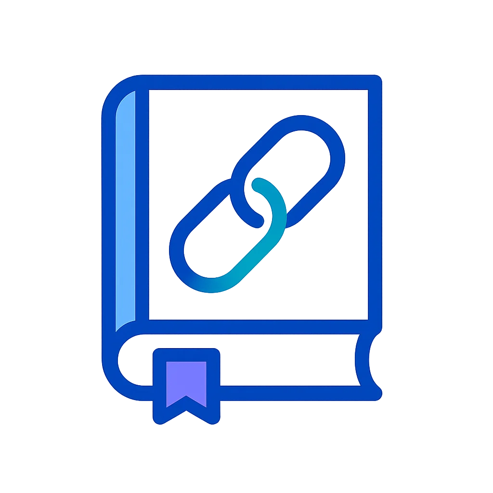

<div align="center">
  
  
  # URL Shortener Documentation
  
  **📚 Modern documentation for the URL Shortener project**
  
  Built with [Docusaurus](https://docusaurus.io/) v3 - A modern static website generator
  
  [](https://docusaurus.io/)
  [](https://reactjs.org/)
  [](https://www.typescriptlang.org/)
</div>

---

## 🎨 Features

- **Modern Design** - Beautiful gradient hero, glassmorphism effects, and smooth animations
- **Educational Focus** - Clean, simple design perfect for learning
- **Dark Mode** - Full dark mode support with optimized color schemes
- **Responsive** - Mobile-first design that works on all devices
- **Search** - Fast local search (when enabled)
- **PWA Ready** - Progressive Web App support for offline access

## 🚀 Quick Start

### Prerequisites

- Node.js 18.0 or above
- npm or yarn package manager

### Installation

```bash
# Using npm
npm install

# Using yarn
yarn
```

### Local Development

```bash
# Using npm
npm start

# Using yarn
yarn start

# Start without opening browser
npm run start -- --no-open
```

This command starts a local development server at `http://localhost:3000`. Most changes are reflected live without having to restart the server.

## 📁 Project Structure

```
docs-site/
├── docs/                  # Documentation files
│   ├── api/              # API documentation
│   ├── architecture/     # Architecture guides
│   ├── caching/          # Caching patterns
│   ├── development/      # Development guides
│   └── monitoring/       # Monitoring setup
├── src/
│   ├── components/       # React components
│   ├── css/              # Custom CSS
│   └── pages/            # Custom pages
├── static/
│   └── img/              # Images and logos
├── docusaurus.config.ts  # Main configuration
└── sidebars.ts           # Sidebar configuration
```

## 🍨 Customization

### Theme Colors

The modern design system is defined in `src/css/custom.css`:

- **Primary Colors**: Blue gradient (#0066ff to #6366f1)
- **Hero Gradient**: Purple gradient for hero section
- **Dark Mode**: Fully optimized dark theme

### Logo

- **Documentation Logo**: `static/img/logo.webp`
- **Repository Logo**: `static/img/repo_logo.webp`

### Content

- **Documentation**: Edit files in the `docs/` directory
- **Homepage**: Customize `src/pages/index.tsx`

## 🏭 Building for Production

```bash
# Using npm
npm run build

# Using yarn
yarn build
```

This command generates static content into the `build` directory that can be served using any static hosting service.

### Build Optimization

```bash
# Clear cache before building
npm run clear && npm run build

# Type checking
npm run typecheck
```

## 🚀 Deployment

### GitHub Pages

```bash
# Using SSH
USE_SSH=true yarn deploy

# Using HTTPS
GIT_USER=<Your GitHub username> yarn deploy
```

### Static Hosting

The `build` folder can be deployed to:
- Netlify
- Vercel
- GitHub Pages
- AWS S3
- Any static hosting service

### Docker

```dockerfile
# Build the documentation
FROM node:18-alpine AS builder
WORKDIR /app
COPY package*.json ./
RUN npm ci
COPY . .
RUN npm run build

# Serve with nginx
FROM nginx:alpine
COPY --from=builder /app/build /usr/share/nginx/html
EXPOSE 80
```

## 🔧 Development Tips

### Enable Local Search

```bash
# Install search plugin
npm install @easyops-cn/docusaurus-search-local

# Enable in environment
DOCS_ENABLE_LOCAL_SEARCH=true npm start
```

### Writing Documentation

1. **Markdown Files**: All docs are in Markdown format
2. **Front Matter**: Use YAML front matter for metadata
3. **MDX Support**: Use React components in Markdown
4. **Code Blocks**: Syntax highlighting for multiple languages

### Adding a New Doc

1. Create a new `.md` file in the appropriate `docs/` subfolder
2. Add front matter:
   ```yaml
   ---
   sidebar_position: 1
   title: Your Title
   ---
   ```
3. Write your content
4. Update `sidebars.ts` if needed

## 📝 License

This documentation is part of the URL Shortener educational project.

## 🤝 Contributing

Contributions to improve the documentation are welcome!

1. Fork the repository
2. Create a feature branch
3. Make your changes
4. Submit a pull request

## 🔗 Links

- [Main Repository](https://github.com/your-username/url_shortener)
- [Live Documentation](https://your-docs-site.com)
- [Docusaurus Documentation](https://docusaurus.io/docs)

---

<div align="center">
  Made with ❤️ for educational purposes
</div>
