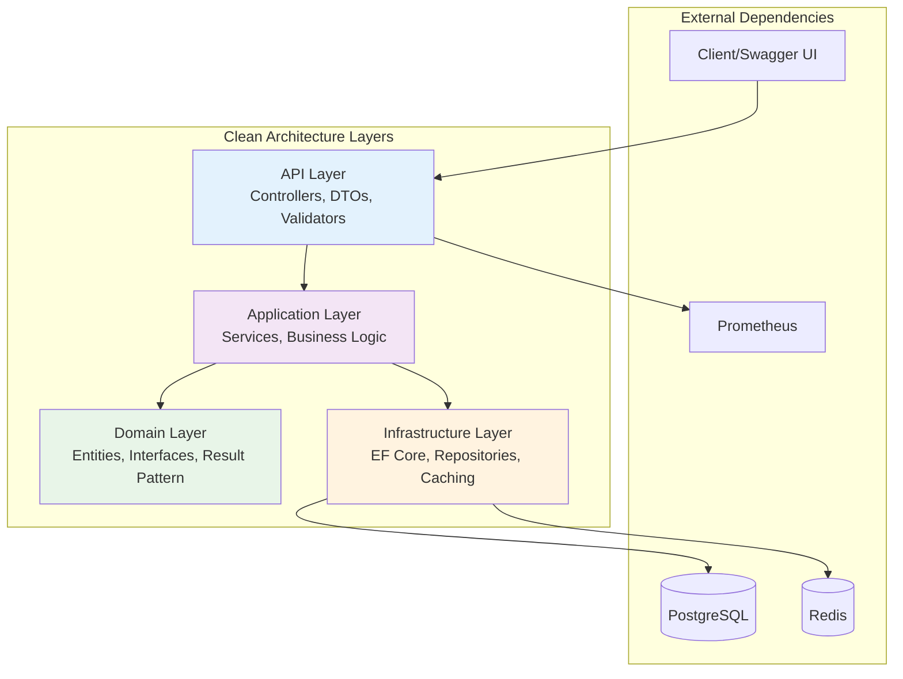

The URL Shortener implements Clean Architecture principles with clear separation of concerns across four main layers.

## Architecture Overview



## Layer Responsibilities

### 1. API Layer (`src/API/`)
**Purpose**: Entry point and external interface
- **Controllers**: HTTP endpoint handling (`UrlShortenerController.cs`)
- **DTOs**: Request/response data transfer objects
- **Validators**: FluentValidation request validation
- **Program.cs**: Application configuration and DI setup

### 2. Application Layer (`src/Application/`)
**Purpose**: Business logic orchestration
- **Services**: Core business operations (`UrlMappingService.cs`)
- **Models**: Application-specific models (`RedirectCache.cs`)
- **Handlers**: Command/query handlers (if using CQRS)

### 3. Domain Layer (`src/Domain/`)
**Purpose**: Core business rules and entities
- **Entities**: Business objects (`UrlMapping.cs`, `BaseEntity.cs`)
- **Interfaces**: Contracts for external dependencies
- **Result Pattern**: Functional error handling (`Result.cs`, `Error.cs`)

### 4. Infrastructure Layer (`src/Infrastructure/`)
**Purpose**: External concerns and data access
- **Data**: Database context and configuration
- **Repositories**: Data access implementations
- **Migrations**: Database schema changes

## Dependency Rules

The architecture follows strict dependency rules:

```
API → Application → Domain ← Infrastructure
```

- **Inward Dependencies Only**: Each layer can only depend on layers closer to the center
- **Domain Independence**: Domain layer has no external dependencies
- **Interface Segregation**: Infrastructure implements interfaces defined in Domain
- **Dependency Inversion**: High-level modules don't depend on low-level modules
