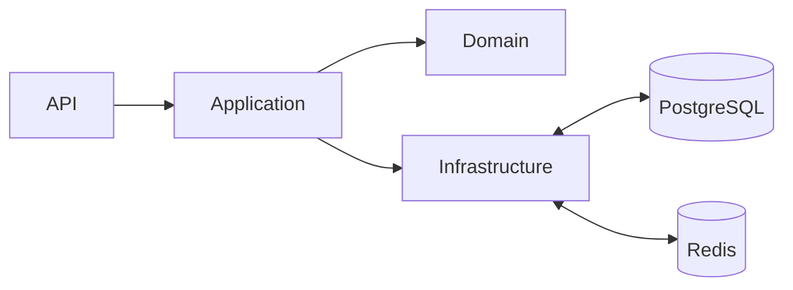

```mermaid
flowchart LR
  A[API] --> B[Application]
  B --> C[Domain]
  B --> D[Infrastructure]
  D <--> DB[(PostgreSQL)]
  D <--> R[(Redis)]
```

- API: Controllers and Program.cs
- Application: Business logic and services
- Domain: Entities and interfaces
- Infrastructure: EF Core, repositories, external integrations
