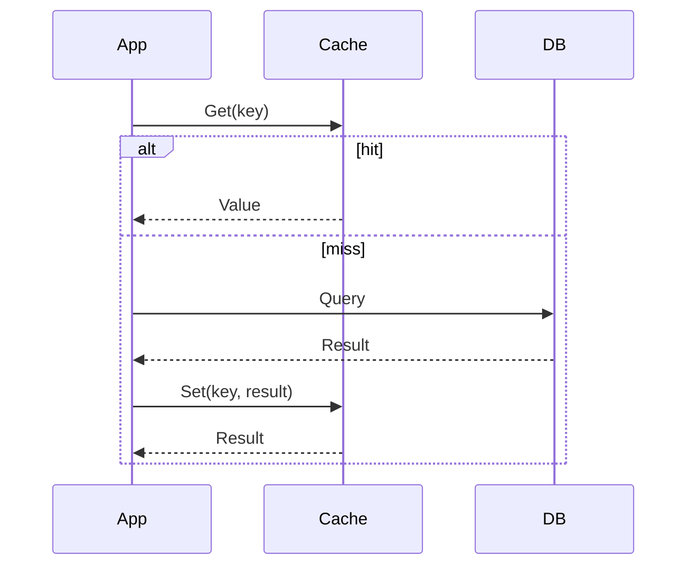

```mermaid
sequenceDiagram
  participant App
  participant Cache
  participant DB

  App->>Cache: Get(key)
  alt hit
    Cache-->>App: Value
  else miss
    App->>DB: Query
    DB-->>App: Result
    App->>Cache: Set(key, result)
    Cache-->>App: Result
  end
```

- Cache-Aside (lazy loading)
- Read-Through
- Write-Through
- Write-Behind
