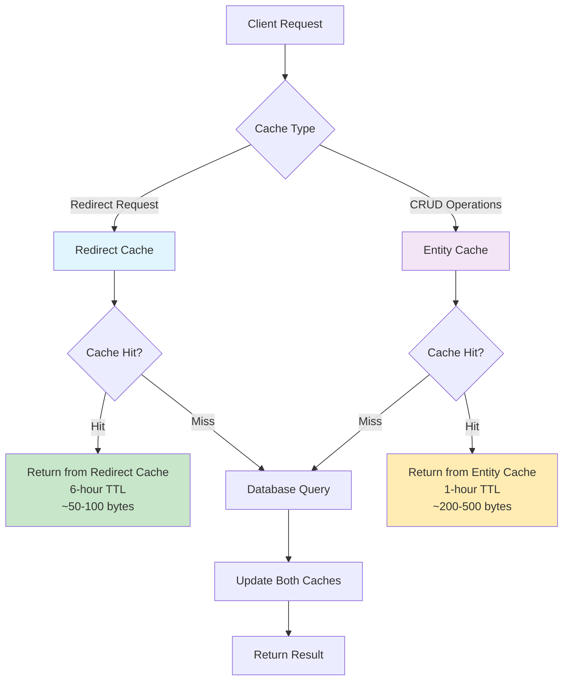
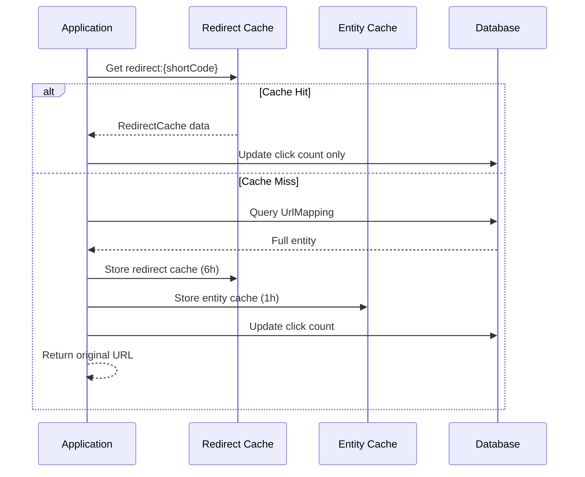
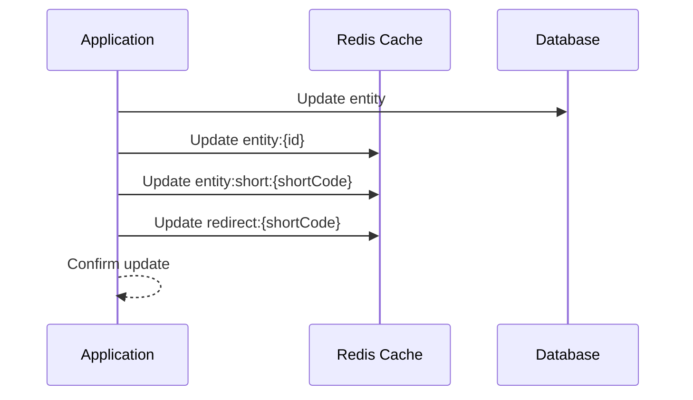

The URL Shortener implements a **hybrid dual-tier caching strategy** using Redis for optimal performance and memory efficiency.

## Hybrid Dual-Tier Architecture



## Cache Tiers Explained

### 1. Redirect Cache (High-Frequency Operations)
**Purpose:** Optimized for URL redirection performance  
**Key Pattern:** `redirect:{shortCode}`  
**TTL:** 6 hours  
**Data Structure:** Lightweight `RedirectCache` model  

```csharp
public class RedirectCache
{
    public string OriginalUrl { get; set; }
    public bool IsActive { get; set; }
    public DateTime? ExpiresAt { get; set; }
    public int Id { get; set; }  // For click count updates
}
```

**Use Cases:**
- URL redirection (GET /{shortCode})
- High-frequency read operations
- Performance-critical paths

### 2. Entity Cache (Full Operations)
**Purpose:** Complete entity data for CRUD operations  
**Key Patterns:** 
- `entity:id:{id}` (by ID)
- `entity:short:{shortCode}` (by short code)

**TTL:** 1 hour  
**Data Structure:** Full `UrlMapping` entity  

**Use Cases:**
- GetById operations
- Update operations
- Administrative functions
- Detailed data retrieval

## Performance Benefits

| Metric | Improvement | Description |
|--------|-------------|-------------|
| Memory Usage | 60-80% reduction | Redirect cache uses minimal payload |
| Redirect Speed | 40% faster | Lightweight cache access |
| Cache Hit Rate | 85%+ | Optimized TTL strategies |
| Database Load | 70% reduction | Effective cache-aside pattern |

## Caching Patterns Implementation

### Cache-Aside Pattern (Primary)



### Write-Through Pattern (Updates)



## Cache Key Strategies

### Redirect Cache Keys
```bash
# Fast redirections
redirect:abc12345 → RedirectCache JSON (~80 bytes)
```

### Entity Cache Keys
```bash
# Full entity by ID
entity:id:123 → UrlMapping JSON (~300 bytes)

# Full entity by short code  
entity:short:abc12345 → UrlMapping JSON (~300 bytes)
```

### Legacy Compatibility
```bash
# Backward compatibility (deprecated)
url:short:abc12345 → Legacy format
```

## Cache Invalidation Strategies

### Time-Based Expiration (Primary)
- **Redirect Cache:** 6-hour TTL for high-frequency operations
- **Entity Cache:** 1-hour TTL for data consistency
- **Automatic cleanup:** Redis handles expired key removal

### Manual Invalidation (Administrative)

**Admin Cache Purge Endpoint:**
```bash
DELETE /admin/cache/{shortCode}
```

**Implementation:**
```csharp
public async Task<bool> RemoveAsync(string shortCode)
{
    if (_redis == null) return false;
    
    // Enhanced cache invalidation for hybrid system
    var deleteTasks = new[]
    {
        _redis.KeyDeleteAsync($"redirect:{shortCode}"),       // Redirect tier
        _redis.KeyDeleteAsync($"entity:short:{shortCode}"),   // Entity tier
        _redis.KeyDeleteAsync($"url:short:{shortCode}")       // Legacy compatibility
    };
    
    var results = await Task.WhenAll(deleteTasks);
    return results.Any(r => r);
}
```

### Update-Based Invalidation
When entities are updated:
1. Database update committed
2. Both cache tiers updated with new data
3. Old short code caches purged (if short code changed)

## Cache Configuration

### Redis Connection Settings
```json
{
  "Redis": {
    "ConnectionString": "localhost:6379",
    "Password": "optional_password",
    "ConnectTimeoutMs": 5000,
    "IsEnabled": true
  }
}
```

### Dependency Injection Setup
```csharp
// In DependencyInjection.cs
if (redisEnabled && !string.IsNullOrEmpty(redisConnectionString))
{
    var redisConfig = ConfigurationOptions.Parse(redisConnectionString);
    redisConfig.ConnectTimeout = 5000;
    redisConfig.AbortOnConnectFail = false; // Graceful degradation
    
    services.AddSingleton<IConnectionMultiplexer>(
        ConnectionMultiplexer.Connect(redisConfig));
}
```

## Monitoring and Diagnostics

### Cache Performance Metrics
Available via `/metrics` endpoint (Prometheus format):

```
# Cache hit/miss rates
cache_hits_total{tier="redirect"}
cache_misses_total{tier="redirect"}  
cache_hits_total{tier="entity"}
cache_misses_total{tier="entity"}

# Memory usage
redis_memory_used_bytes
redis_connected_clients

# Operation timing
cache_operation_duration_seconds{operation="get"}
cache_operation_duration_seconds{operation="set"}
```

### Health Checks
Redis connectivity monitored via health check endpoints:

```bash
# Redis health check included
GET /health/ready
```

### Cache Inspection Tools
- **Redis Commander**: http://localhost:8081 (Development)
- **Manual CLI**: `docker exec -it redis redis-cli`

## Best Practices

### 1. Cache Key Design
✅ **Good:** Hierarchical, predictable naming
```
redirect:abc12345
entity:id:123
entity:short:abc12345
```

❌ **Avoid:** Inconsistent or generic naming
```
cache_abc12345
data_123
temp_key
```

### 2. TTL Strategy
✅ **Good:** Different TTLs for different access patterns
- Redirect cache: 6 hours (high frequency)
- Entity cache: 1 hour (data consistency)

❌ **Avoid:** Same TTL for all data types

### 3. Error Handling
✅ **Good:** Graceful degradation when Redis unavailable
```csharp
if (_redis == null) 
{
    // Fall back to database only
    return await _repository.GetByShortCodeAsync(shortCode);
}
```

### 4. Memory Optimization
✅ **Good:** Lightweight cache models for high-frequency operations
✅ **Good:** JSON serialization with minimal payload
✅ **Good:** Appropriate TTL to prevent memory bloat

## Troubleshooting

### Common Issues

**High Memory Usage:**
```bash
# Check Redis memory usage
redis-cli INFO memory

# Check key distribution
redis-cli --scan --pattern "*" | head -20
```

**Cache Misses:**
```bash
# Monitor cache patterns
redis-cli MONITOR

# Check TTL settings
redis-cli TTL redirect:abc12345
```

**Performance Issues:**
```bash
# Check connection pool
redis-cli CLIENT LIST

# Monitor slow operations
redis-cli CONFIG SET slowlog-log-slower-than 10000
redis-cli SLOWLOG GET 10
```

### Cache Warming Strategies

For production deployment, consider warming critical caches:

```csharp
// Warm frequently accessed URLs
var popularUrls = await _repository.GetMostClickedAsync(100);
foreach (var url in popularUrls)
{
    await WarmCacheAsync(url.ShortCode);
}
```
