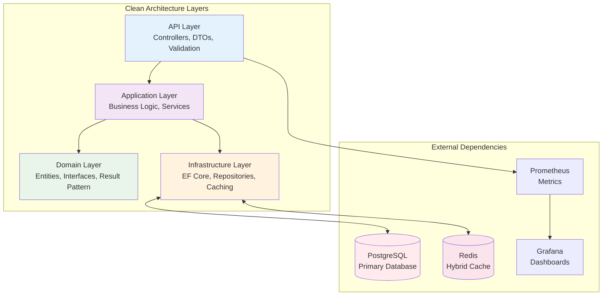

URL Shortener is a high-performance ASP.NET Core 9.0 service that transforms long URLs into short, reliable links with advanced caching, monitoring, and enterprise-grade features.

## 🎯 Core Features

- **Clean Architecture**: API → Application → Domain → Infrastructure
- **Advanced Caching**: Hybrid dual-tier Redis caching strategy  
- **Rich API**: Full CRUD operations with metadata support
- **Monitoring**: Prometheus metrics + Grafana dashboards
- **Health Checks**: Liveness, readiness, and detailed health endpoints
- **Error Handling**: Comprehensive Result pattern implementation
- **PostgreSQL + Entity Framework Core**: Robust data persistence
- **Docker Compose**: Complete development environment

## 🚀 Quick Links

### Getting Started
- **[Local Setup](./development/local-setup.md)** → Complete development environment setup
- **[Docker Compose](./development/docker-compose.md)** → Container-based development 
- **[Database Migrations](./development/migrations.md)** → Schema management and updates

### API Reference  
- **[Endpoints](./api/endpoints.md)** → Complete API documentation with examples
- **[DTOs](./api/dto.md)** → Request/response data structures
- **[Error Handling](./development/error-handling.md)** → Result pattern and validation

### Architecture & Design
- **[Clean Architecture](./architecture/clean-architecture.md)** → Project structure and dependencies
- **[Data Model](./data-model/entities.md)** → Entities, relationships, and database schema
- **[Advanced Caching](./caching/patterns.md)** → Hybrid dual-tier caching system

### Operations & Monitoring
- **[Monitoring](./monitoring/observability.md)** → Prometheus, Grafana, health checks
- **[Development Guide](./development/local-setup.md)** → Local development workflow

## 🏗️ Architecture Overview



## 📊 Technology Stack

### Core Framework
- **ASP.NET Core 9.0** - Latest .NET framework
- **Entity Framework Core** - Modern ORM with migrations
- **FluentValidation** - Robust request validation
- **Result Pattern** - Functional error handling

### Data & Caching
- **PostgreSQL 16** - Primary database
- **Redis 7** - Hybrid dual-tier caching
- **Connection Pooling** - Optimized database connections
- **Cache Strategies** - Cache-aside, write-through patterns

### Monitoring & Observability
- **Prometheus** - Metrics collection and alerting
- **Grafana** - Visualization and dashboards  
- **Health Checks** - Application and dependency monitoring
- **Structured Logging** - Comprehensive logging with context

### Development Tools
- **Docker Compose** - Local development environment
- **Supabase Studio** - Modern PostgreSQL management
- **Redis Commander** - Cache inspection and management
- **Swagger/OpenAPI** - Interactive API documentation

## 📈 Performance Features

### Hybrid Dual-Tier Caching
```
┌─────────────────────┐    ┌──────────────────────┐
│   Redirect Cache    │    │    Entity Cache      │
│  (6-hour TTL)      │    │   (1-hour TTL)      │
│  ~50-100 bytes     │    │  ~200-500 bytes     │
│                    │    │                     │
│  High-frequency    │    │  Full CRUD          │
│  redirections      │    │  operations         │ 
└─────────────────────┘    └──────────────────────┘
```

**Benefits:**
- 60-80% memory reduction for redirects
- 85%+ cache hit rates
- 40% faster redirect performance
- 70% reduction in database load

### Database Optimizations
- **Indexed queries** for short codes and click counts
- **Bulk operations** for maintenance tasks
- **Connection pooling** for high concurrency
- **AsNoTracking** queries for read-only operations

## 🔍 API Capabilities

### Core Operations
```bash
# Create short URL with metadata
POST /UrlShortener
{
  "originalUrl": "https://example.com/long-url",
  "customShortCode": "my-link1",
  "title": "Example Page",
  "description": "Demo page",
  "expiresAt": "2024-12-31T23:59:59Z"
}

# Get popular URLs
GET /UrlShortener/MostClicked/10

# Admin cache management  
DELETE /admin/cache/abc12345
```

### Administrative Features
- **Bulk expiration** of URLs
- **Cache invalidation** endpoints
- **Health monitoring** with detailed status
- **Metrics export** for monitoring systems

## 📚 Documentation Structure

This documentation is organized into focused sections:

| Section | Purpose | Key Topics |
|---------|---------|------------|
| **API** | Endpoint reference and usage | Endpoints, DTOs, examples |
| **Architecture** | System design and patterns | Clean architecture, modules, DI |
| **Caching** | Performance optimization | Hybrid caching, patterns, strategies |
| **Data Model** | Database schema and entities | Entities, relationships, migrations |
| **Development** | Local setup and workflows | Setup, migrations, error handling |
| **Monitoring** | Observability and operations | Health checks, metrics, alerting |

## 🎓 Learning Resources

This project demonstrates advanced C# and .NET patterns:

### Modern C# Features
- **Result Pattern** for functional error handling
- **Records and DTOs** for immutable data structures
- **Pattern Matching** with switch expressions  
- **Nullable Reference Types** for null safety
- **Async/Await** throughout the application stack

### Architecture Patterns
- **Clean Architecture** with clear separation of concerns
- **Repository Pattern** for data access abstraction
- **Dependency Injection** for loose coupling
- **CQRS Principles** (implicit) with read/write separation

### Performance Patterns  
- **Cache-Aside** for optimized data access
- **Connection Pooling** for database efficiency
- **Bulk Operations** for maintenance tasks
- **Asynchronous Programming** throughout

## 🚦 Getting Started

Ready to explore? Start with these paths:

### For Developers
1. **[Local Setup](./development/local-setup.md)** - Set up your development environment
2. **[API Endpoints](./api/endpoints.md)** - Understand the API capabilities  
3. **[Clean Architecture](./architecture/clean-architecture.md)** - Learn the project structure

### For DevOps/Operations  
1. **[Docker Compose](./development/docker-compose.md)** - Container deployment
2. **[Monitoring](./monitoring/observability.md)** - Set up monitoring stack
3. **[Database Migrations](./development/migrations.md)** - Schema management

### For Learning/Study
1. **[Caching Patterns](./caching/patterns.md)** - Advanced caching strategies
2. **[Error Handling](./development/error-handling.md)** - Result pattern implementation
3. **[Data Model](./data-model/entities.md)** - Entity design and relationships

---

*This URL Shortener demonstrates modern .NET development practices, performance optimization techniques, and enterprise-grade monitoring. Explore the codebase to learn about building high-performance web APIs with C# and ASP.NET Core.*
